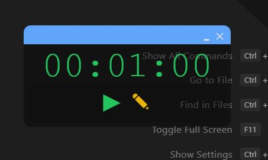
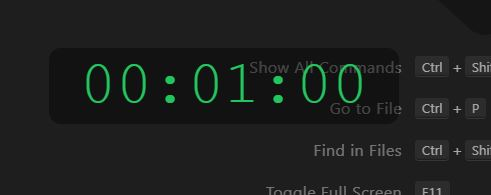

# Timer Overlay App Built with Electron.js and React.js

## About:

I created this timer-app to help me track down how much time I spend on coding tasks. Being able to use the app while utilizing my entire screen was a priority that's why I opted for creating an overlay mode that makes the app visible but allows me to click through it. Entering and exiting overlay is done with hotkeys.

### Regular Mode:



### Overlay Mode



## Features: 
- Input the desired time to be counted down from.
- Overlay mode activated with hotkey "control/command + 6"

- An alarm sound.

<br/>

#### Feel free to clone and run the project on your system! Have fun with it and let me know what you think. Your feedback is valuable in improving the app for everyone.

#### ⭐ If you find the project useful please give it a start so others can find it too! :)
<br/>

## Recommended IDE Setup

- [VSCode](https://code.visualstudio.com/) + [ESLint](https://marketplace.visualstudio.com/items?itemName=dbaeumer.vscode-eslint) + [Prettier](https://marketplace.visualstudio.com/items?itemName=esbenp.prettier-vscode)

## Dependencies:
- Make sure you have node.js and NPM installed. 

## Project Setup

### Install

```bash
$ npm install
```

### Development

```bash
$ npm run dev
```

### Build

```bash
# For windows
$ npm run build:win

# For macOS
$ npm run build:mac

# For Linux
$ npm run build:linux
```

## If you would like to see how I made it, and find ways to customize it, you can watch step by step tutorial on Youtube:

[](https://www.youtube.com/watch?v=6sMM5tGZUaQ)

### 😀Happy Coding!

